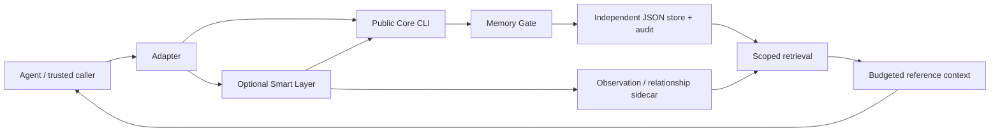
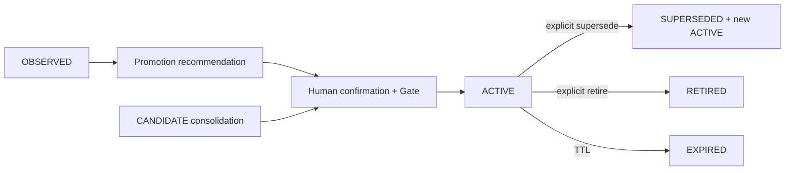

# Agent Memory OS

A model-agnostic memory governance layer for AI agents.

**Remember less. Remember better.**

Current candidate: **0.9.0-rc1** (`0.9.0rc1` in Python package metadata).

Keep selected, confirmed facts instead of feeding complete chat histories back
into an agent. The Gate checks what may be saved; lifecycle actions preserve
changes and audit; retrieval returns scoped ACTIVE facts under a character budget.
Core does not require an LLM. The optional Smart Layer is deterministic too.

## 5-minute Quick Start

Requires **Python >=3.11** and Git. No runtime dependencies or external API.
The repository is public; runtime stores remain private and Git ignored.
On Linux/macOS use `python3` if `python` is unavailable, or activate a venv.

```sh
git clone https://github.com/hcxhcx1981-hash/agent-memory-os.git
cd agent-memory-os
python -m cli --help
python examples/demo.py --quickstart-only
```

The script runs public CLI **evaluate → add → retrieve → inject → conflict →
supersede**, verifies history links, duplicate handling and unrelated-project
exclusion, then prints `DEMO=PASS`. Each run initializes a new fictional store
under ignored `work/`, never overwriting existing data. Scripted confirmations
apply only to fictional examples.

For individual commands, choose a fresh `storage/quickstart.json`:

```sh
python -m cli --store storage/quickstart.json evaluate --candidate examples/theme.json
python -m cli --store storage/quickstart.json add --candidate examples/theme.json
python -m cli --store storage/quickstart.json retrieve default_theme --project Project-Mercury
python -m cli --store storage/quickstart.json inject default_theme --project Project-Mercury --budget 300
python -m cli --store storage/quickstart.json evaluate --candidate examples/theme-change.json
```

Expected: ACCEPT, ACCEPT with a record ID, graphite-purple, graphite-purple,
then CONFLICT. Copy the old record ID from add/conflict into the following command
only after deciding to confirm this fictional replacement:

```sh
python -m cli --store storage/quickstart.json supersede OLD_ID --candidate examples/theme-change.json --reason "Demo user confirmed replacement"
python -m cli --store storage/quickstart.json inject default_theme --project Project-Mercury --budget 300
```

Only obsidian-green is now injected; the old record is SUPERSEDED and auditable.
`--store` goes **before** every command. A missing store is read as empty and is
created by the first accepted write; evaluate alone does not create it.
`search` is an alias of Core retrieve.

## Why governance instead of chat history?

Chat history mixes temporary states, guesses, repetition and obsolete facts.
This project stores selected facts and audit events, not a complete transcript.
Do not automatically import chat history or save every message.

- **Memory Gate:** checks confirmation, source, obvious sensitive patterns,
  type, duplicates and scoped fact-key conflicts. Decisions are ACCEPT,
  DUPLICATE, CONFLICT, UPDATE or REJECT. `confirmed=true` must come from a trusted
  human-facing caller, never the model's own claim.
- **Supersede:** explicit replacement keeps the old record, reciprocal links
  and audit. Conflict never silently authorizes replacement.
- **Promotion:** repeats form recommendations, not permission. Separate human
  confirmation is required. An already explicitly confirmed durable fact may
  pass directly through the Smart Layer and formal Core Gate.
- **Consolidation:** joins compatible clauses without rewriting meaning.
  Confirmation creates a derived record; original sources remain auditable.
  Known contradictions block it; source revisions are revalidated.
- **Context-aware retrieval:** optional weighted lexical retrieval filters by
  lifecycle, TTL, project, agent, machine and type. Injection avoids repeating a
  valid aggregate and its fragments. This is not general semantic search.





Only valid ACTIVE facts enter normal context. Rejected candidate content is
not saved; rejection audit contains fixed reasons. Types and state details:
[Lifecycle](docs/memory-lifecycle.md).

## Installation and demo

See [Windows / Linux / macOS installation](docs/installation.md) for Python,
venv, direct-run, optional package install, backup and deletion. No administrator
access, winget, Homebrew or global package write access is needed.

```sh
python -m unittest discover -v
python examples/demo.py
python scripts/release-security-check.py --history
```

The full demo adds temporary EPISODIC, duplicate, confirmed promotion,
consolidation with source IDs, explain and why. No Hermes or network is needed.
Inside an activated venv, optional installation is:

```sh
python -m pip install .
memory --help
python examples/demo.py --command memory
```

## Agent integration

[Hermes Quick Start](docs/hermes-quickstart.md) covers the independent Skill
Router, installation/removal, diagnostics and true cross-session verification.
Verified host: **v0.21.5+6750.gea81748**, using fictional fixtures. Routing depends
on the host model following the Skill, not an enforced Hook. Native Hermes
Memory remains separate.

[Build an adapter](docs/build-an-adapter.md) provides a generic Python/CLI
contract. A read-only Codex Adapter / Inspector is included; WorkBuddy and DHAF adapters are not implemented.
See [Architecture](docs/architecture.md), [Smart Layer](docs/smart-layer.md)
and the frozen [record schema](schemas/memory_record.v1.json).

## Current limitations

Single user, serialized writes. Atomic JSON replacement does not provide a
concurrent-write lock or cross-file Core/Smart transaction. No encryption,
database, vector store, embeddings, cloud sync or Web UI. Sensitive detection
and natural-language contradiction recognition are finite heuristics, not DLP
or a general reasoning guarantee. Use stable `metadata.fact_key` values for
changeable properties. Budgets count characters rather than model tokens.
Core CLI retrieval has fewer scope controls than optional smart retrieval.

RC preparation does not promise 1.0 stability or security. No new GitHub Release or PyPI publication is performed by this change.

## License and contributing

[Apache-2.0](LICENSE) permits commercial use and modification. Redistribution
requires applicable license/attribution (including [NOTICE](NOTICE)) and change
notices. Section 3 grants specified contributor patent rights and includes a
patent-litigation termination condition; it is not blanket patent clearance,
trademark permission or a warranty. See the
[official license](https://www.apache.org/licenses/LICENSE-2.0) and
[dependency/provenance review](docs/license-audit.md).

[Contributing](CONTRIBUTING.md) · [Security](SECURITY.md) ·
[Roadmap](ROADMAP.md) · [Changelog](CHANGELOG.md) ·
[Code of conduct](CODE_OF_CONDUCT.md)


## Independent stores and Codex Inspector

Agent defaults use separate Hermes and Codex stores. Cross-agent sharing must be
explicit. The read-only Codex Inspector retrieves project/machine/agent scoped
context on demand; native Codex memory remains separate. Public `move` preserves
IDs and provenance with Gate, journal recovery and RETIRED source history.
See [Codex quick start](docs/codex-quickstart.md).
