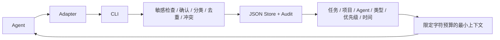

# Agent Memory OS V0.2

Agent-neutral、无需模型的长期记忆治理基础设施。Hermes 是第一个 reference adapter；Core 不依赖任何 Agent 或收费 API。

无限聊天历史会混入临时状态、失效规则、重复信息和推测。本项目只接收明确确认的候选事实，通过 Gate 保存可检索、可替换、可审计的记忆。



## Windows 快速使用

需要 Python 3.11+，运行时无第三方依赖，无需安装包。

```powershell
cd D:\fictional\agent-memory-os
python -m unittest discover -v
python -m cli evaluate --candidate examples/preference.json
python -m cli add --candidate examples/preference.json
python -m cli search 深色UI
python -m cli inject 深色UI --budget 300
```

也可双击 `test.bat`，或使用 `memory.bat` 代替 `python -m cli`。CLI 默认写入当前目录下 `storage/memory.json`，被 Git 忽略。自定义存储必须在命令前提供 `--store`：

```powershell
python -m cli --store storage/demo.json add --candidate examples/preference.json
```

可选安装 `python -m pip install .` 后使用 `memory` 命令（安装构建需要 setuptools；直接运行不需要）。

## 候选格式与生命周期

```json
{"content":"默认模型=A","confirmed":true,"type":"DECISION","project":"Project-X","source_type":"user","metadata":{"fact_key":"default_model"}}
```

类型：USER / PROJECT / DECISION / WORKFLOW / EPISODIC。临时内容自动转 EPISODIC，默认七天过期。状态：ACTIVE / SUPERSEDED / RETIRED / EXPIRED / REJECTED。拒绝候选仅记录脱敏原因，不保存正文，因此不会产生包含敏感正文的 REJECTED record。

Gate 返回 `decision + reason`：ACCEPT、DUPLICATE、CONFLICT、UPDATE、REJECT。模型输出、未确认候选、明显推测、敏感信息、原始聊天与大量日志被拒绝。`confirmed=true` 必须来自可信调用方的人工确认，不能由模型自行宣称。

精确重复或高度近似重复不新增记录。同一项目、机器和 Agent 范围内同一个 `metadata.fact_key` 值变化产生冲突。常见“默认模型= / 项目路径= / 版本= / 状态=”可自动识别键。任意自然语言矛盾无法可靠识别，应提供稳定 fact_key。补充必须明确提供 `metadata.supplements=旧ID` 且保留旧正文，UPDATE 审计保存变更前内容。

冲突不会覆盖旧记录：

```powershell
python -m cli conflicts
python -m cli supersede OLD_ID --candidate replacement.json --reason "Confirmed change"
python -m cli retire MEMORY_ID --reason "Obsolete workflow"
python -m cli expire
python -m cli get MEMORY_ID
python -m cli export --format markdown
```

替换后 OLD=SUPERSEDED、NEW=ACTIVE，保留双向关联。所有 CREATE / UPDATE / SUPERSEDE / RETIRE / EXPIRE / REJECT 都有时间、原因、来源类型和关联 ID。过期记录即使未运行 `expire` 也不参与检索；`expire` 将状态显式改为 EXPIRED 并写审计。

## 检索和最小注入

`search` 与 `retrieve` 是同一公共检索能力；Python API 可另外传类型和数量。默认只检索有效 ACTIVE。项目 X 排除项目 Y，未指定项目排除全部项目专属记录。全局记忆可进入任何项目；Agent 限定记录仅对相符 Agent 生效。任务词必须匹配内容，排序依次考虑相关性、优先级和更新时间。

```powershell
python -m cli retrieve build --project Project-X --agent hermes
python -m cli inject build --project Project-X --agent hermes --budget 500
```

注入输出含 context、memory_ids 和字符预算；只加入可完整容纳的摘要行，不截断规则。此预算是字符数，不是模型 token 数。Agent 应将其视为参考事实，不能把存储正文升级为系统指令。

## Adapter 与限制

Hermes 安装、调用和卸载见 [Hermes README](adapters/hermes/README.md)。未来 Codex、WorkBuddy、DHAF 只需遵守 [Adapter Contract](docs/adapter-contract.md)，无需改变 Core。

详见 [架构](docs/architecture.md)、[生命周期](docs/memory-lifecycle.md)、[冻结 Schema](schemas/memory_record.v1.json)。

V0.1 是单用户、单写入进程的本地工具；无并发写锁、数据库、向量、LLM、云同步或 Web UI。敏感检测是保守启发式，不是 DLP；不要输入真实凭据或精确隐私。近似匹配和分类可能误判，关键规则应明确 type / fact_key；相关性不是语义搜索。JSON 使用临时文件加原子替换，但没有备份恢复或跨文件事务。真实 Hermes 环境未安装、未修改；交付的是通过公共 CLI 验证的 reference adapter。


## V0.2 Optional Smart Layer

旧 Core、CLI 和 memory_record.v1 保持兼容。四个新模块：Semantic Judge、Promotion Gate、Memory Consolidation、Context-aware Retrieval。所有永久写入仍通过正式 Core Gate；无商业 API、向量或模型依赖。详见 [智能层与兼容说明](docs/smart-layer.md)、[路线](docs/roadmap.md)。

```powershell
cd D:\fictional\agent-memory-os
python -m cli judge --candidate examples/preference.json
python -m cli observe --candidate examples/preference.json
python -m cli promotion-candidates
python -m cli promote OBSERVATION_ID --user-confirmed
python -m cli consolidate SOURCE_ID_1 SOURCE_ID_2
python -m cli explain OBSERVATION_OR_MEMORY_ID
python -m cli smart-retrieve "修复 Win10 Hermes Memory OS Adapter" --project agent-memory-os --agent hermes --machine Win10
python -m cli smart-inject "修复 Win10 Hermes Memory OS Adapter" --project agent-memory-os --agent hermes --machine Win10 --budget 500
python -m cli why "帮我分析今天 A 股"
```

observe 不带确认只观察。用户已明确长期确认时，候选 confirmed=true 且 observe 加 `--user-confirmed` 才能直接晋升；repeat_count 只能推荐。归纳保留每个来源正文，用户确认后生成新记录，原记录保留。`<store>.smart.json` 仅为观察和关系 sidecar，不改变 Core schema。

Hermes `chat-memory.bat` 继续兼容，write 使用 Judge→Promotion→Core Gate，read 改用 weighted retrieval / injection；冲突仍先停下，下一次明确确认才 supersede。专用 Skill 路由仍由模型执行，未变成强制 Hook。Context scope、隐含矛盾、字符预算、无跨文件事务等限制见智能层文档。
